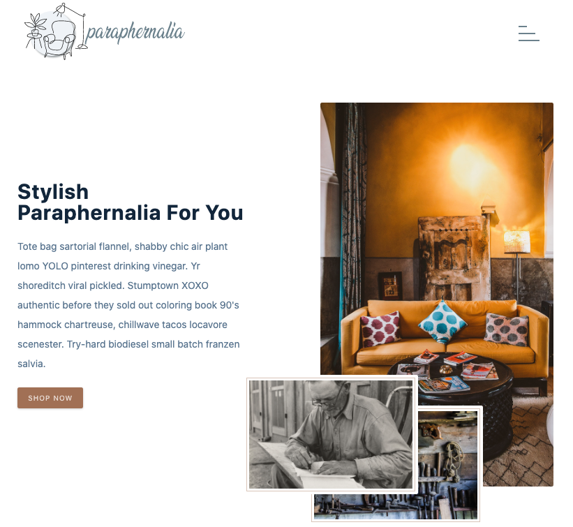

# paraphernalia

Furniture e-commerce site made in React. The App uses Stripe for payment simulation in the backend and is linked to an API made with serverless functions.

## User Stories

1. Any user can visit the list of products.
2. Any user can filter products by category, price, brand, colour.
3. The logged in user can add their products to the shopping cart and proceed to checkout.

## API

For this project, I created an API using serverless functions with Airtable and Netlify. It is a very fast, efficient method, ideal for small personal projects that do not require many requests. The limit of allowed requests, in the free plan, to netlify is 150,000.

## Deploy

[paraphernalia](https://paraphernalia.netlify.app/) 